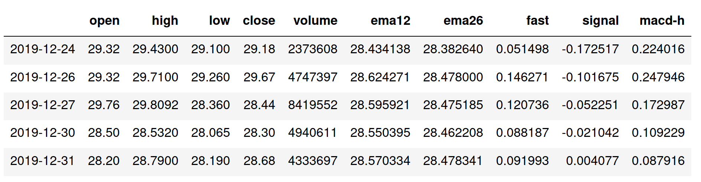
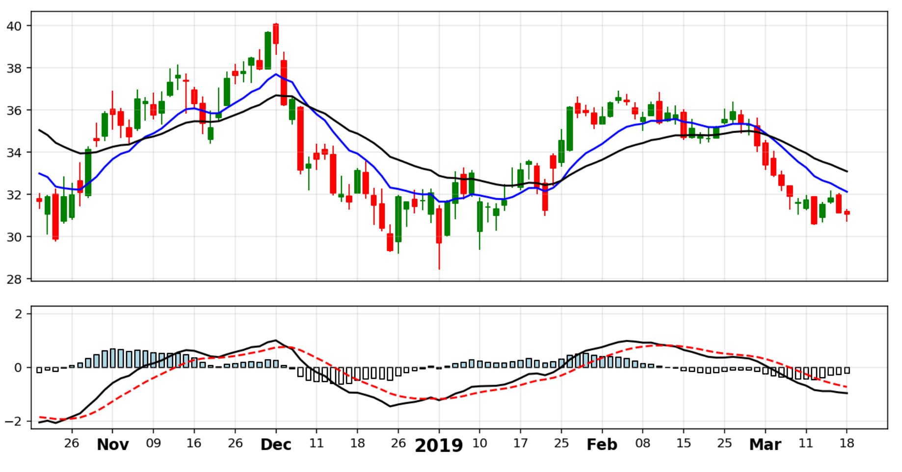
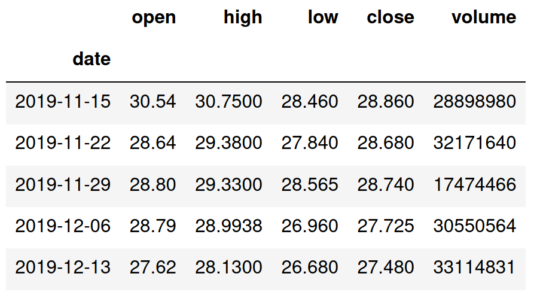
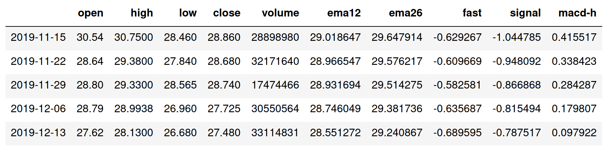
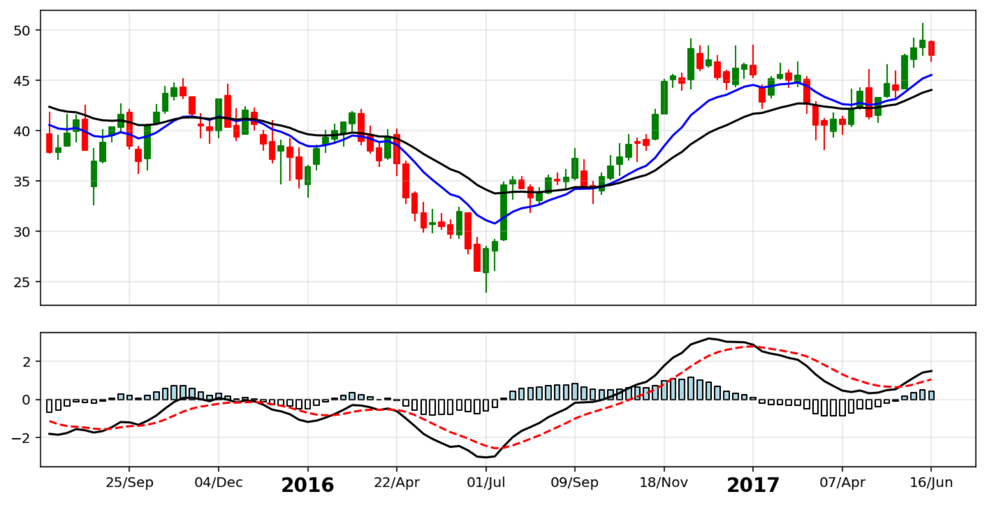

######
Gander
######

***********************************************************
Technical indicators and plotting for stock market analysis
***********************************************************

Authors:
* Ole Olaussen: ole.olaussen@ekkobit.com
* Xuan Ling: xuan.ling@ekkobit.com

============
Installation
============

.. code-block:: shell

  pip install gander

========
Examples
========

.. code-block:: python

  import gander.indicators as gi
  import gander.plotting as gp
  import matplotlib.pyplot as plt

Using Matplotlib and Gander to create daily stock charts
--------------------------------------------------------

Let's say we have a Pandas DataFrame of a stocks data and we want to make a
chart of a subset of the data. Our DataFrame might look something
like this:

Adding indicators to the data set
^^^^^^^^^^^^^^^^^^^^^^^^^^^^^^^^^

.. code-block:: python

  df = gi.calc_ema(df, df["close"], "ema12", window=13)
  df = gi.calc_ema(df, df["close"], "ema26", window=27)
  df = gi.calc_macd(df, df["ema12"], df["ema26"])

This will give us something like this:

To get a subset of the data and positions on the x-axis, we can do:

.. code-block:: python

  df_plot = df[-300:-200]
  xpos = range(100)

Building figure and subplots
^^^^^^^^^^^^^^^^^^^^^^^^^^^^

.. code-block:: python

  fig = plt.figure(figsize=(12, 6))
  ax1 = plt.subplot2grid((3, 1), (0, 0), rowspan=2)
  ax2 = plt.subplot2grid((3, 1), (2, 0), rowspan=1)
  ticks, labels = gp.daily_labels(df_plot, df_plot.index, step=5)

Customizing x-axis ticks, labels and grid
^^^^^^^^^^^^^^^^^^^^^^^^^^^^^^^^^^^^^^^^^

.. code-block:: python

  for ax in [ax1, ax2]:
      ax.set_xlim(xmin=-1, xmax=104)
      ax.set_xticks(ticks)
      ax.grid(alpha=0.3)

  ax1.xaxis.set_ticklabels([])
  ax1.tick_params(axis='x', length=0)
  ax2.set_xticklabels(labels)

  for label in ax2.get_xticklabels():
      if len(label.get_text()) == 4:
          label.set_fontsize(14)
          label.set_fontweight("bold")
      elif len(label.get_text()) == 3:
          label.set_fontsize(12)
          label.set_fontweight("bold")
      else:
          label.set_fontsize(10)

Adding plots
^^^^^^^^^^^^

.. code-block:: python

  gp.candles(df_plot, ax1)
  ax1.plot(xpos, df_plot["ema12"], "b-")
  ax1.plot(xpos, df_plot["ema26"], "k-")
  gp.macds(df_plot, ax2, "fast", "signal", "macd-h")

Using Matplotlib and Gander to create weekly stock charts
---------------------------------------------------------

Let's again say we have a Pandas DataFrame of a stocks data and we want to make
a chart of a subset of the data data. Only this time we have weekly
data. Our DataFrame might look something like this:

Adding indicators to the data set
^^^^^^^^^^^^^^^^^^^^^^^^^^^^^^^^^

.. code-block:: python

  df = gi.calc_ema(df, df["close"], "ema12", window=13)
  df = gi.calc_ema(df, df["close"], "ema26", window=27)
  df = gi.calc_macd(df, df["ema12"], df["ema26"])

This will give us something like this:

To get a subset of the data and positions on the x-axis, we can again do:

.. code-block:: python

  df_plot = df[-230:-130]
  xpos = range(100)

The process of building the chart is the same as for daily data, except we
might do different customizations to the lables on the x-axis:

Building figure and subplots
^^^^^^^^^^^^^^^^^^^^^^^^^^^^

.. code-block:: python

  fig = plt.figure(figsize=(12, 6))
  ax1 = plt.subplot2grid((3, 1), (0, 0), rowspan=2)
  ax2 = plt.subplot2grid((3, 1), (2, 0), rowspan=1)
  ticks, labels = gp.weekly_labels(df_plot, df_plot.index, step=10)

Customizing x-axis ticks, labels and grid
^^^^^^^^^^^^^^^^^^^^^^^^^^^^^^^^^^^^^^^^^

.. code-block:: python

  for ax in [ax1, ax2]:
      ax.set_xlim(xmin=-1, xmax=104)
      ax.set_xticks(ticks)
      ax.grid(alpha=0.3)

  ax1.xaxis.set_ticklabels([])
  ax1.tick_params(axis='x', length=0)
  ax2.set_xticklabels(labels)

  for label in ax2.get_xticklabels():
      if len(label.get_text()) == 4:
          label.set_fontsize(14)
          label.set_fontweight("bold")

Adding plots
^^^^^^^^^^^^

.. code-block:: python

  gp.candles(df_plot, ax1)
  ax1.plot(xpos, df_plot["ema12"], "b-")
  ax1.plot(xpos, df_plot["ema26"], "k-")
  gp.macds(df_plot, ax2, "fast", "signal", "macd-h")

==========
Contribute
==========

* Issue Tracker: https://github.com/ekkobit/gander/issues
* Source Code: https://github.com/ekkobit/gander
* Documentation: https://gander.readthedocs.io
