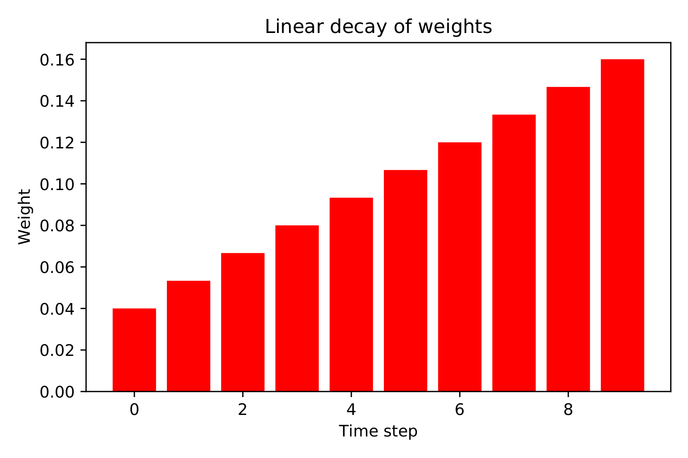
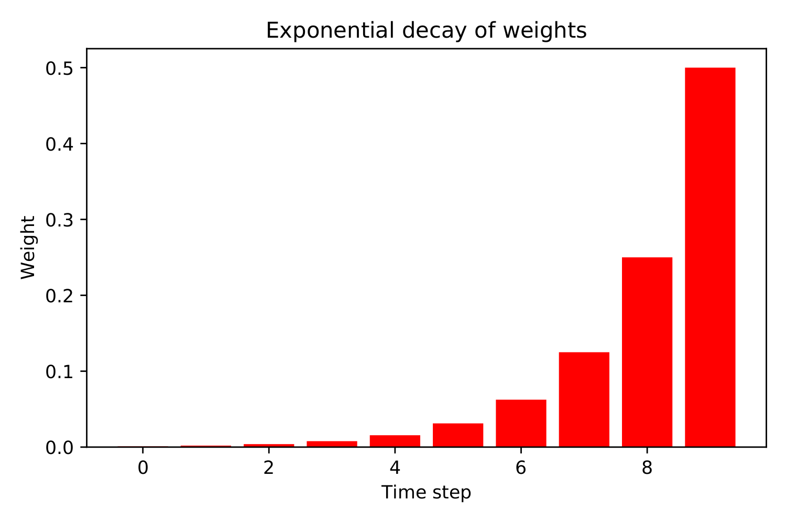

Also known as **EMWA** - Exponentially Weighted Moving Average.

The Why
-------

What we want from an **ema** is an indicator that, unlike a :ref:`sma`, doesn't
give equal weight to all previous data points, when depicting trends --- but
rather an indicator that places more trust in recent data points and less trust
in more distant previous events on the timeline.

The How
-------

Let's first consider a :ref:`sma`:

.. math::

    \text{sma}_t = \dfrac{\sum\limits_{i=0}^{n} \text{price}_{(t-i)}}{n + 1}

If we set :math:`n = 3` and abriviate price to `p`, starting at :math:`t = 3`
and looking back in time, we can expand the calculation in the following manner:

.. math::

    \dfrac{p_3 + p_2 + p_1 + p_0}{4} ~ = ~ \frac{1}{4} p_3 + \frac{1}{4} p_2 +
    \frac{1}{4} p_1 + \frac{1}{4} p_0

As we can see, the weights are equal and they sum to unity:

.. math::

    \frac{1}{4} + \frac{1}{4} + \frac{1}{4} + \frac{1}{4} ~ = ~ 1

That's integral to calculating averages. Now, if we wanted to give less weight
to far gone price points, we could do reduce the weights as we go back:

.. math::

    \frac{7}{22} + \frac{6}{22} + \frac{5}{22} + \frac{4}{22} ~ = ~ 1

This represents a backwards linear decay of the weights for the price points.
Here's what that could look like:

If we wanted to introduce a bit of curve to the decay, so the weights would
decrease more rapidly, perhaps we could do something like:

.. math::

    \frac{1}{2} + \frac{1}{4} + \frac{1}{8} + \frac{1}{16} ~ = ~ 0.875 ~
    \approx ~ 1

Now, :math:`0.875` is not quite unity, but if keep cutting the last term in
half and adding it, we quickly get very close to :math:`1` --- and in the limit
--- we get there. We can check that by adding more and more terms, or we can
take the limit of a handy formula for geometric type series, like the one we
just conjured up.

To see where

.. math::

    a + ar + ar^2 + \cdots + ar^{n-1},

is headed as :math:`n \rightarrow \infty`, we can use

.. math::

    \lim_{n \rightarrow \infty} \sum\limits_{i=0}^{n-1} ar^i ~ = ~
    \lim_{n \rightarrow \infty} ~ a \left( \dfrac{1 - r^n}{1 - r} \right)

As we can see, :math:`a` represents the first term in the series. In our case,
that would be :math:`\frac{1}{2}`. The :math:`r`, is the common ratio --- or
the change each new term represents, in relation to the previous term. In our
case, each new term is halved, so :math:`r = \frac{1}{2}` also. So,

.. math::

    \lim_{n \rightarrow \infty} ~ \frac{1}{2} \left( \dfrac{1 -
    (\frac{1}{2})^{\infty}}{1 - \frac{1}{2}} \right) ~ = ~
    \frac{1}{2} \left(\dfrac{1}{1 - \frac{1}{2}} \right) ~ = ~
    \dfrac{\frac{1}{2}}{\frac{1}{2}} ~ = ~ 1

However, this only applies when :math:`a = (1 - r)`. If, for example, we set
:math:`a = \frac{1}{3}` and keep the :math:`r`, we do not converge to unity:

.. math::

    \frac{1}{3} \left(\dfrac{1}{1 - \frac{1}{2}} \right) ~ = ~
    \dfrac{\frac{1}{3}}{\frac{1}{2}} ~ = ~ \frac{2}{3}

So, in order to have more freedom in setting our weights, we need to be clever
about it. What we want is for

.. math::

    \lim_{n \rightarrow \infty} ~ a \left( \dfrac{1 - r^n}{1 - r} \right) = 1

    \Rightarrow ~ a \left( \dfrac{1}{1 - r} \right) = 1

    \Rightarrow  \dfrac{a}{1 - r} = 1

    \Rightarrow   r = 1 - a

What that gives us is a series that look like this:

.. math::

    a + a(1 - a) + a(1 - a)^2 + a(1 - a)^3 + ~ \cdots ~ + a(1 - a)^{n-1}

Now, this being an infinite series, we know that we have to push :math:`n
\rightarrow \infty`, in order to converge at unity, though it doesn't take a
very large :math:`n` before we're getting close. In our original example with
:math:`a = r = \frac{1}{2}` We're already at :math:`0.99` with :math:`7` terms
in the series sum. We've now finally found a way to create weights with a
rapidly decreasing curve:

On top of that, we've pretty much derived the formula for exponential moving
averages --- :math:`p` again short for price:

.. math::

    \text{ema}_t = \lim_{n \rightarrow \infty} \left[a p_t + a(1 - a)p_{t-1} +
    a(1 - a)^2p_{t-2} + ~ \cdots ~ + a(1 - a)^{n-1}p_{t-(n-1)} \right]

or, factoring out :math:`a`,

.. math::

    \text{ema}_t = \lim_{n \rightarrow \infty} ~ a \left[ p_t + (1 - a)p_{t-1}
    + (1 - a)^2p_{t-2} + ~ \cdots ~ + (1 - a)^{n-1}p_{t-(n-1)} \right]

We can express the exact same thing as a recurrent function:

.. math::

    \text{ema}_t = a p_t + (1 - a) \text{ema}_{t - 1}

I know, I know --- `recurrent functions`, `infinity` --- it can all be a bit of
a mind f%\!\#.  It might be more clear if we take the time to write out two
previous timesteps:

.. math::

    \text{ema}_{t-1} = a p_{t-1} + (1 - a) \text{ema}_{t - 2}

    \text{ema}_{t-2} = a p_{t-2} + (1 - a) \text{ema}_{t - 3},

and then substitute back into the last timestep:

.. math::

    \text{ema}_t = a p_t + (1 - a) \bigg\{ a p_{t-1} + (1 - a) \Big[ a p_{t-2}
    + (1 - a) \text{ema}_{t - 3} \Big] \bigg\}

Rewriting it, we can get:

.. math::

    a p_t + a(1 - a) p_{t-1} + a(1 - a)^2 p_{t-2} + (1 - a)^3 \text{ema}_{t-3}

    a \Big[ p_t + (1 - a) p_{t-1} + (1 - a)^2 p_{t-2} \Big] + (1 - a)^3
    \text{ema}_{t-3}

If we continued to unpack :math:`\text{ema}_{t-3, 4, \cdots}`, we'd eventually
get back to

.. math::

    a \left[ p_t + (1 - a)p_{t-1} + (1 - a)^2p_{t-2} + ~ \cdots ~ +
    (1 - a)^{n-1}p_{t-(n-1)} \right],

if we could allow :math:`n \rightarrow \infty`. As we can see from the formula:

.. math::

    \text{ema}_t = a p_t + (1 - a) \text{ema}_{t - 1},

we always depend, ad infinitum, on the previous ema value, to calculate the
current value.  Our data sets, however, are never infinite, so eventually we
get to :math:`t = 0`. Our only choice then, is to initialize
:math:`\text{ema}_{t=0} = 0` or approximate it somehow. We can set
:math:`\text{ema}_{t=0} = p_{t=0}`, or scoot forward a bit and do
:math:`\text{ema}_{t=k} = \text{sma}_{t=k}, n_{sma} = k - 1`. See :ref:`sma`.
For the most part, how to initialize :math:`\text{ema}_{t=0}`, is not that
great a concern, unless your data set is really small.

Now, one last thing: How do you choose an :math:`a`? Any :math:`a \in (0, 1)`
can be used, but as a matter of convention --- the following will do nicely:

.. math::

    a = \dfrac{2}{n_{sma} + 1}

If you set :math:`n_{sma} = 12` in the above formula, you get what is referred
to as a 12 - period EMA. Of course, as we have seen in this section,
mathematically speaking, EMAs don't have periods. They are created from
approximations of infinite series. What we can say, is that with an :math:`a`
defined in this way, within the :math:`n_{sma} + 1` first terms in the
approximation of the infinite series sum, about 88% of the EMA is
accounted for. Why this percentage has been chosen to represent an
:math:`n_{sma}` period EMA is, as of yet, unknown to us.

How to read and understand EMAs
-------------------------------

- When the overall slope of the EMA is rising, the EMA can serve as support.
  Buy when prices reach down to and below the EMA and place a protective stop
  somewhere below where it turns up again. Be sure to move stop as prices rice,
  to limit risk.

- When the overall slope of the EMA is falling, the EMA can serve as resistance.
  Sell short when prices reach up to and beyond the EMA and place protective
  stop above where it turns down again. Be sure to move stop as prices fall,
  to limit risk.

- When the market goes sideways with no apparent trend, use oscillators and not
  trend-following indicators, such as EMA.
