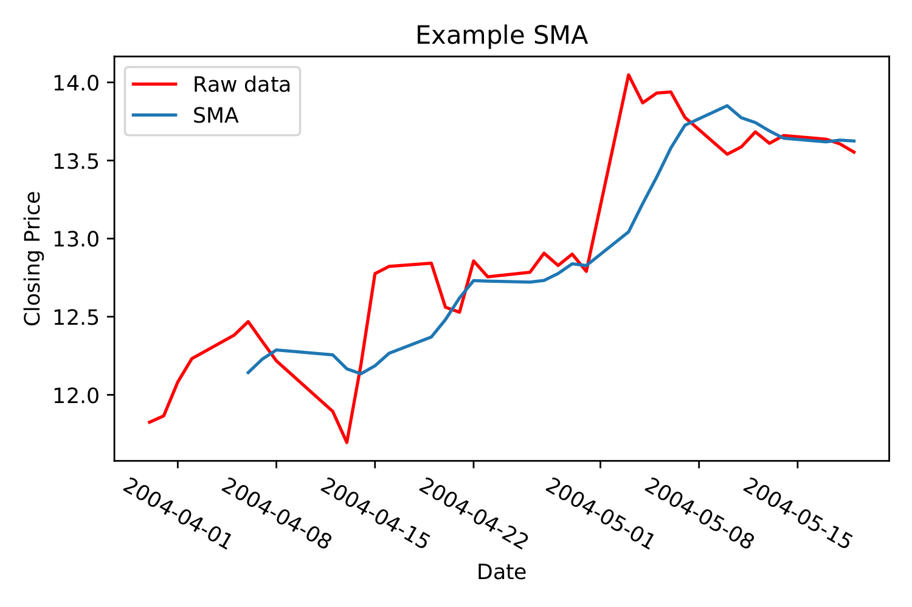

To find the simple moving average at time :math:`t`, take a data point at time
:math:`t` - add to it a certain number of past data points - and divide by the
total number of data points. In the following, let's say our data points are
stock prices.

.. math::

    \text{sma}_t = \dfrac{\sum\limits_{i=0}^{n} \text{price}_{(t-i)}}{n + 1}

:math:`sma_t`
    simple moving average calculated for time :math:`t`

:math:`\text{price}_{(t-i)}`
    Current and previous prices in **sma**
:math:`n`
    Number of `previous` prices to include in calculation. Total number of
    prices is :math:`n + 1`

Let's set :math:`n = 3`,
which means we include 3 previous prices in the **sma**. Now, we can't start at
:math:`t=0`, because we need at least 3 previous prices. At the earliest, we
can start at :math:`t=3`, provided there is such a thing as :math:`t=0`.
So let's expand the formula. At :math:`t=3`. What we get is this:

.. math::

    \text{sma}_{t=3} = \dfrac{p_{(t=3)} + p_{(t=2)} + p_{(t=1)} + p_{(t=0)}}{4},

:math:`p`
    short for price

Effectively, it's a way of smoothing out noise in the data, so we can catch
trends better. The more previous data points we include, the smoother the
graph. Notice, in the graph below, how the first few data points in the sma is
cut off.

